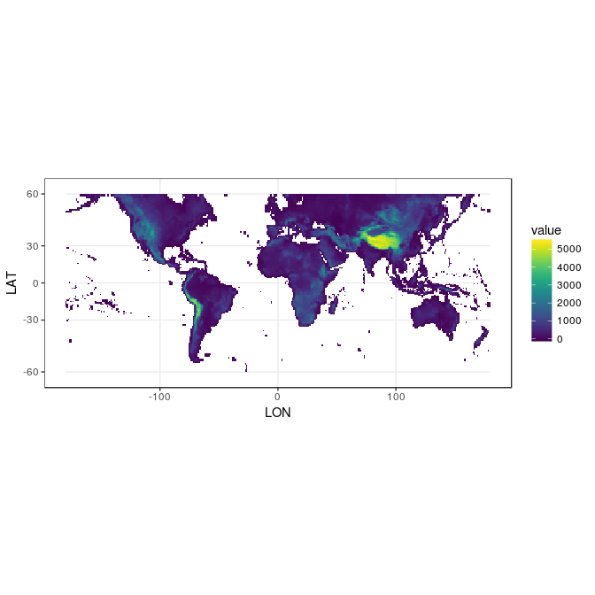

Fetch GSOD Data
================
Adam H Sparks - Centre for Crop Health, USQ

Fetch, Import and Process Elevation Data
========================================

Download Shuttle Radar Topography Mission (SRTM) digital elevation model (DEM) data from the Worldclim Database [(link)](http://www.worldclim.org/) to use in the interpolation as an elevation covariate. Set data type to INT2S since the .bil file is unsigned, set -9999 to NA, then aggregate to 1 arc-degree to match NASA - POWER. Since the DEM covers more area than the agroclimatology data from the *GSODR* package, crop the DEM to match the extent before plotting.

``` r
# load libraries
library(raster)
library(ggplot2)
library(viridis)
#> Loading required package: viridisLite
library(rgdal)

# set up workspace
tf.zip <- tempfile()

download.file(
  "http://biogeo.ucdavis.edu/data/climate/worldclim/1_4/grid/cur/alt_10m_bil.zip",
  destfile = tf.zip,
  mode = "wb"
)
unzip(tf.zip, exdir = tempdir()) # unzip downloaded file
z <-
  raster(paste0(tempdir(), "/alt.bil")) # import elevation raster object
dataType(z) <- "INT2S"

# aggregate the SRTM data
z <- aggregate(z, 6) # aggregate up to 1deg to match NASA - POWER resolution
z[z == -9999] <- NA # set -9999 to NA

z # inspect the object
#> class       : RasterLayer 
#> dimensions  : 150, 360, 54000  (nrow, ncol, ncell)
#> resolution  : 1, 1  (x, y)
#> extent      : -180, 180, -60, 90  (xmin, xmax, ymin, ymax)
#> coord. ref. : +proj=longlat +ellps=WGS84 +towgs84=0,0,0,0,0,0,0 +no_defs 
#> data source : in memory
#> names       : alt 
#> values      : -46.5, 5405.139  (min, max)

# crop SRTM data at -60/60 for agroclimatology only
z <- crop(z, 
          c(
            xmin = -180,
            xmax = 180,
            ymin = -60,
            ymax = 60
          )
)

z_spdf <- as(z, "SpatialPixelsDataFrame")
z_df <- as.data.frame(z_spdf)
colnames(z_df) <- c("value", "x", "y")
```

Plot the DEM
------------

``` r
ggplot() +
  geom_tile(data = z_df, aes(x = x, y = y, fill = value)) +
  scale_fill_viridis() +
  xlab("LON") +
  ylab("LAT") +
  theme_bw() +
  coord_map()
```



### Save the Spatial File to Disk

Using the *rgdal* GeoPackage driver, we will save the file to disk for use in interpolating the data, using the spatial data frame object.

``` r
writeRaster(
  z,
  file = "~/Data/SRTM",
  overwrite = TRUE
)
#> class       : RasterLayer 
#> dimensions  : 120, 360, 43200  (nrow, ncol, ncell)
#> resolution  : 1, 1  (x, y)
#> extent      : -180, 180, -60, 60  (xmin, xmax, ymin, ymax)
#> coord. ref. : +proj=longlat +ellps=WGS84 +towgs84=0,0,0,0,0,0,0 +no_defs 
#> data source : /home/ubuntu/Data/SRTM.grd 
#> names       : alt 
#> values      : -46.5, 5405.139  (min, max)
```

------------------------------------------------------------------------

Appendices
==========

R Session Information
---------------------
