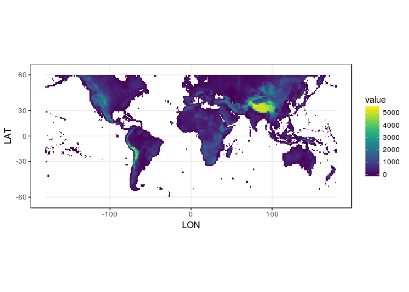

Fetch GSOD Data
================
Adam H Sparks - Centre for Crop Health, USQ

Fetch, Import and Process Elevation Data
========================================

Download Shuttle Radar Topography Mission (SRTM) digital elevation model (DEM) data from the Worldclim Database [(link)](http://www.worldclim.org/) to use in the interpolation as an elevation covariate. Set data type to INT2S since the .bil file is unsigned, set -9999 to NA, then aggregate to 1 arc-degree to match NASA - POWER. Since the DEM covers more area than the agroclimatology data from the *GSODR* package, crop the DEM to match the extent before plotting.

``` r
# load libraries
library(raster)
library(ggplot2)
library(viridis)
library(rgdal)

# set up workspace
tf.zip <- tempfile()

download.file(
  "http://biogeo.ucdavis.edu/data/climate/worldclim/1_4/grid/cur/alt_10m_bil.zip",
  destfile = tf.zip,
  mode = "wb"
)
unzip(tf.zip, exdir = tempdir()) # unzip downloaded file
z <-
  raster(paste0(tempdir(), "/alt.bil")) # import elevation raster object
dataType(z) <- "INT2S"

# aggregate the SRTM data
z <- aggregate(z, 6) # aggregate up to 1deg to match NASA - POWER resolution
z[z == -9999] <- NA # set -9999 to NA

z # inspect the object
#> class       : RasterLayer 
#> dimensions  : 150, 360, 54000  (nrow, ncol, ncell)
#> resolution  : 1, 1  (x, y)
#> extent      : -180, 180, -60, 90  (xmin, xmax, ymin, ymax)
#> coord. ref. : +proj=longlat +ellps=WGS84 +towgs84=0,0,0,0,0,0,0 +no_defs 
#> data source : in memory
#> names       : alt 
#> values      : -46.5, 5405.139  (min, max)

# crop SRTM data at -60/60 for agroclimatology only
z <- crop(z, 
          c(
            xmin = -180,
            xmax = 180,
            ymin = -60,
            ymax = 60
          )
)

z_spdf <- as(z, "SpatialPixelsDataFrame")
z_df <- as.data.frame(z_spdf)
colnames(z_df) <- c("value", "x", "y")
```

Plot the DEM
------------

``` r
ggplot() +
  geom_tile(data = z_df, aes(x = x, y = y, fill = value)) +
  scale_fill_viridis() +
  xlab("LON") +
  ylab("LAT") +
  theme_bw() +
  coord_map()
```



### Save the Spatial File to Disk

Using the *rgdal* GeoPackage driver, we will save the file to disk for use in interpolating the data, using the spatial data frame object.

``` r
writeRaster(
  z,
  file = "~/Data/SRTM/SRTM_1deg",
  overwrite = TRUE
)
#> class       : RasterLayer 
#> dimensions  : 120, 360, 43200  (nrow, ncol, ncell)
#> resolution  : 1, 1  (x, y)
#> extent      : -180, 180, -60, 60  (xmin, xmax, ymin, ymax)
#> coord. ref. : +proj=longlat +ellps=WGS84 +towgs84=0,0,0,0,0,0,0 +no_defs 
#> data source : /home/ubuntu/Data/SRTM/SRTM_1deg.grd 
#> names       : alt 
#> values      : -46.5, 5405.139  (min, max)
```

------------------------------------------------------------------------

Appendices
==========

R Session Information
---------------------

    #> ─ Session info ──────────────────────────────────────────────────────────
    #>  setting  value                       
    #>  version  R version 3.4.2 (2017-09-28)
    #>  os       Ubuntu 16.04.3 LTS          
    #>  system   x86_64, linux-gnu           
    #>  ui       X11                         
    #>  language (EN)                        
    #>  collate  en_AU.UTF-8                 
    #>  tz       Zulu                        
    #>  date     2017-11-21                  
    #> 
    #> ─ Packages ──────────────────────────────────────────────────────────────
    #>  package     * version date       source        
    #>  backports     1.1.1   2017-09-25 CRAN (R 3.4.2)
    #>  clisymbols    1.2.0   2017-05-21 CRAN (R 3.4.2)
    #>  colorspace    1.3-2   2016-12-14 CRAN (R 3.4.2)
    #>  devtools      1.13.4  2017-11-09 CRAN (R 3.4.2)
    #>  digest        0.6.12  2017-01-27 CRAN (R 3.4.2)
    #>  evaluate      0.10.1  2017-06-24 CRAN (R 3.4.2)
    #>  ggplot2     * 2.2.1   2016-12-30 CRAN (R 3.4.2)
    #>  gridExtra     2.3     2017-09-09 CRAN (R 3.4.2)
    #>  gtable        0.2.0   2016-02-26 CRAN (R 3.4.2)
    #>  htmltools     0.3.6   2017-04-28 CRAN (R 3.4.2)
    #>  knitr         1.17    2017-08-10 CRAN (R 3.4.2)
    #>  labeling      0.3     2014-08-23 CRAN (R 3.4.2)
    #>  lattice       0.20-35 2017-03-25 CRAN (R 3.3.3)
    #>  lazyeval      0.2.1   2017-10-29 CRAN (R 3.4.2)
    #>  magrittr      1.5     2014-11-22 CRAN (R 3.4.2)
    #>  mapproj       1.2-5   2017-06-08 CRAN (R 3.4.2)
    #>  maps          3.2.0   2017-06-08 cran (@3.2.0) 
    #>  memoise       1.1.0   2017-04-21 CRAN (R 3.4.2)
    #>  munsell       0.4.3   2016-02-13 CRAN (R 3.4.2)
    #>  plyr          1.8.4   2016-06-08 CRAN (R 3.4.2)
    #>  raster      * 2.6-7   2017-11-13 CRAN (R 3.4.2)
    #>  Rcpp          0.12.13 2017-09-28 CRAN (R 3.4.2)
    #>  rgdal       * 1.2-15  2017-10-30 CRAN (R 3.4.2)
    #>  rgeos         0.3-26  2017-10-31 CRAN (R 3.4.2)
    #>  rlang         0.1.4   2017-11-05 CRAN (R 3.4.2)
    #>  rmarkdown     1.8     2017-11-17 CRAN (R 3.4.2)
    #>  rprojroot     1.2     2017-01-16 CRAN (R 3.4.2)
    #>  rstudioapi    0.7     2017-09-07 CRAN (R 3.4.2)
    #>  scales        0.5.0   2017-08-24 CRAN (R 3.4.2)
    #>  sessioninfo   1.0.0   2017-06-21 CRAN (R 3.4.2)
    #>  sp          * 1.2-5   2017-06-29 CRAN (R 3.4.2)
    #>  stringi       1.1.5   2017-04-07 CRAN (R 3.4.2)
    #>  stringr       1.2.0   2017-02-18 CRAN (R 3.4.2)
    #>  tibble        1.3.4   2017-08-22 CRAN (R 3.4.2)
    #>  viridis     * 0.4.0   2017-03-27 CRAN (R 3.4.2)
    #>  viridisLite * 0.2.0   2017-03-24 CRAN (R 3.4.2)
    #>  withr         2.1.0   2017-11-01 CRAN (R 3.4.2)
    #>  yaml          2.1.14  2016-11-12 CRAN (R 3.4.2)
